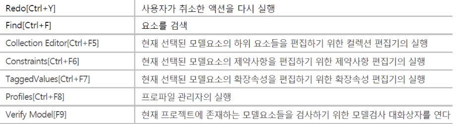
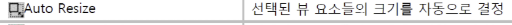
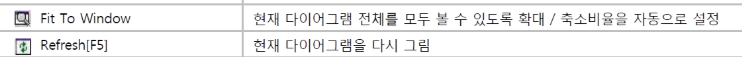
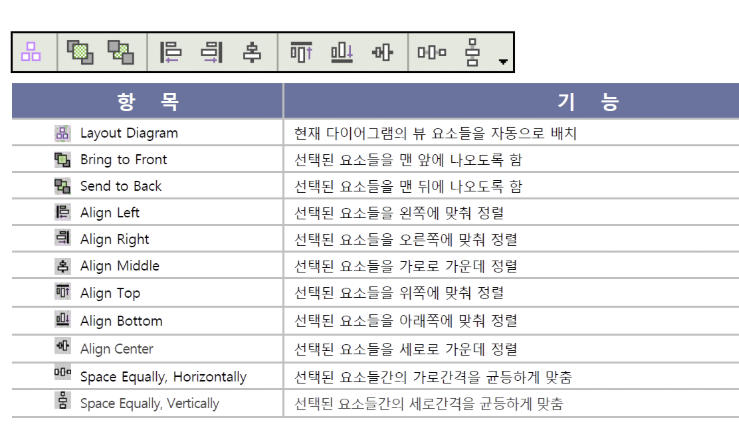

### StarUML study  

 
Ctrl + Shift + R

##### sequential diagram  
* Interactions(Advanced)   
  * Combined fragment  
    * specific interacted operator   
      1. double click  
      2. renamed specific interacted operator  
    * interacted operator   
      1. double click  
      2. 'Add Operand' floats  
      3. make guard expenssion  
 
* Annotations  
  * Text  
  * Note  
  * Note Link  
  * Hyperlink  

---  
[참조 사이트1](https://valueelectronic.tistory.com/3)  
[참조 사이트2](https://valueelectronic.tistory.com/7?category=788401)